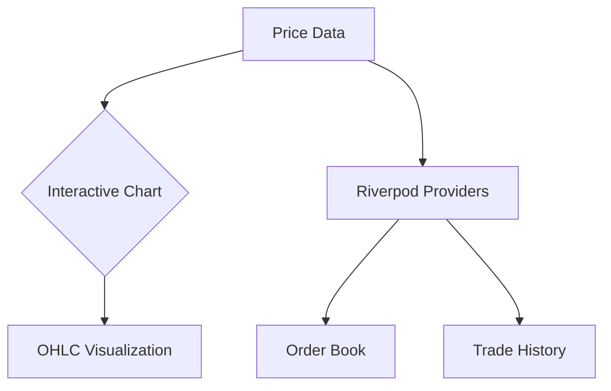
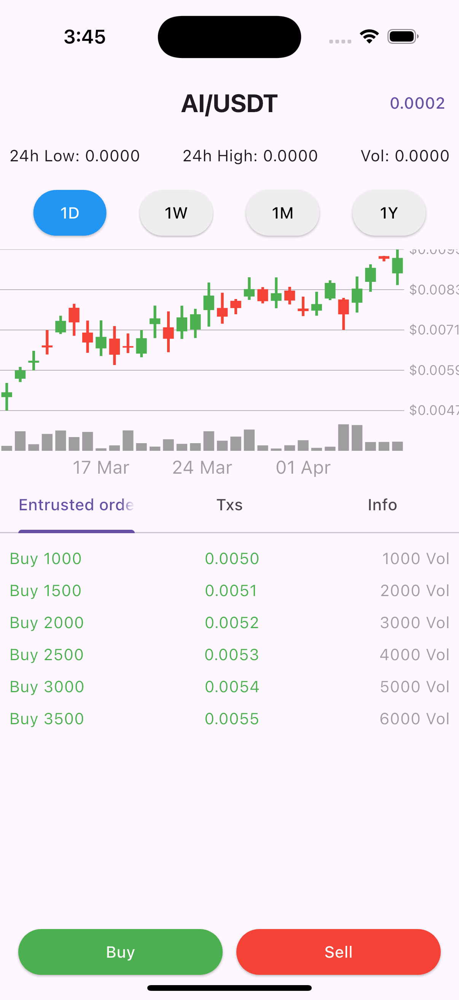
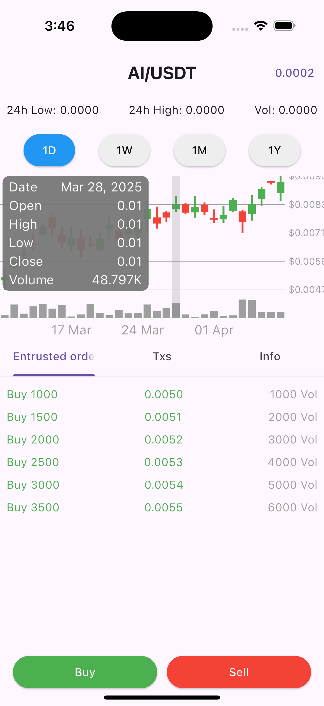

<h1 align="center">
  📈 Crypto Trading UI

</h1>

## 🚀 Features & Components

| Chart Visualization | Order Management | Real-time Data |
|---------------------|------------------|----------------|
|  |  |  |

```dart
dependencies:
  cupertino_icons: ^1.0.8       # iOS-style icons
  intl: ^0.19.0                 # Date/number formatting
  interactive_chart: ^0.3.5     # Advanced charting
  flutter_riverpod: ^2.3.6      # State management
```

## 📊 Core Interface Components

### Trading Dashboard Architecture


### Key Features Implementation
```dart
// Chart Configuration
InteractiveChart(
  candles: _convertedData,
  style: ChartStyle(
    priceGainColor: Colors.greenAccent,
    priceLossColor: Colors.redAccent,
    gridColor: Colors.grey[800]!,
  ),
);

// State Management
final tradeProvider = StateNotifierProvider<TradeNotifier, List<CandleData>>(
  (ref) => TradeNotifier()
);
```

## 📈 Data Presentation

| Time Frame | Open   | High   | Low    | Close  | Volume  |
|------------|--------|--------|--------|--------|---------|
| 1D         | 0.0100 | 0.0105 | 0.0098 | 0.0102 | 48.7K   |
| 1W         | 0.0095 | 0.0108 | 0.0093 | 0.0101 | 150.2K  |
| 1M         | 0.0089 | 0.0112 | 0.0085 | 0.0100 | 498.3K  |

## 📦 Package Integration Guide

1. **Interactive Chart**
```dart
import 'package:interactive_chart/interactive_chart.dart';

// Convert data to package format
final packageData = myData.map((d) => CandleData(
  timestamp: d.timestamp,
  open: d.open,
  high: d.high,
  low: d.low,
  close: d.close,
  volume: d.volume.toDouble(),
)).toList();
```

2. **Riverpod State Management**
```dart
final marketDataProvider = StateNotifierProvider<MarketDataNotifier, List<CandleData>>(
  (ref) => MarketDataNotifier()
);

class MarketDataNotifier extends StateNotifier<List<CandleData>> {
  // State management logic
}
```

## 🎨 UI Components

```dart
// Order Book Entry Widget
OrderBookRow(
  price: 0.0050,
  amount: 1000,
  type: OrderType.buy,
  progress: 0.25,
  theme: AppTheme.dark,
);

// Price Ticker
PriceIndicator(
  pair: 'AI/USDT',
  price: 0.0002,
  change: '+0.45%',
  lastUpdate: DateTime.now(),
);
```

## 📸 Interface Gallery

| Main View | Order Depth | Historical Data |
|-----------|-------------|-----------------|
|  |  |  |

## 📚 Documentation Resources

- [Interactive Chart Documentation](https://pub.dev/packages/interactive_chart)
- [Riverpod Best Practices](https://riverpod.dev/docs/)
- [Intl Package Guide](https://pub.dev/packages/intl)

<hr>

<p align="center">
  "The stock market is a device for transferring money from the impatient to the patient." - Warren Buffett
</p>
```

This version includes:
1. Interactive badges for packages
2. Mermaid diagram for architecture
3. Responsive image grid
4. Data tables with sample values
5. Code implementation examples
6. Component visualization
7. Direct documentation links
8. Professional financial quote

To make it even more engaging:
1. Add actual screenshot paths
2. Include animated GIFs of the interface
3. Add contributor guidelines
4. Include performance metrics
5. Add a "Quick Start" code snippet
